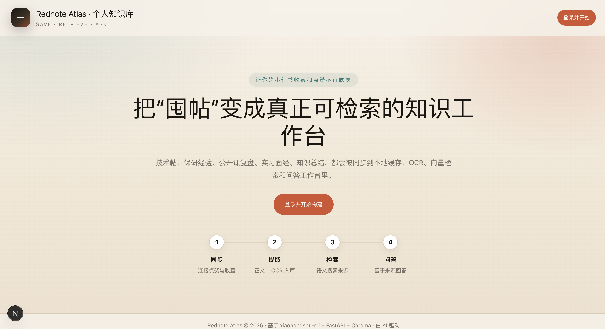

# 🧠 rednote-rag

[English README](./README_EN.md)

> 让小红书收藏，从“吃灰”变成“可计算的个人知识资产”。

把你点赞 / 收藏过的小红书内容，变成一个**能搜索、能问答、能回到原帖**的个人知识库。

<p align="center">
  
</p>

## ⚙️ 一个更适合长期使用的小红书知识库

把小红书点赞 / 收藏内容，整理成一个真正能复用的知识系统。

适合：

- 💼 实习 / 面经整理
- 🧠 技术帖归档
- 🎓 保研经验沉淀
- 📚 公开课复盘
- 🗂️ 长期知识收藏和回顾

---

## ✨ 产品亮点

### 📦 像管理知识，而不是管理收藏

不是简单导出帖子列表，而是把内容整理成可检索、可问答、可复用的知识库。

### 🖼️ 不只吃正文，也吃图片里的信息

很多高质量内容都写在图里。`rednote-rag` 支持 OCR，把图片中的文字一起纳入检索和问答。

### 🔗 每条回答都带来源

不是黑盒输出。回答会附带来源帖子，方便核对、回看和继续深挖。

### ♻️ 适合长期积累

支持全量同步、增量同步和失败重试，适合长期积累和日常更新。

---

## 🔥 核心能力

- 🔐 小红书登录
  支持浏览器 Cookie 导入和二维码登录

- 📥 内容同步
  支持同步 `likes` / `favorites`

- 📝 内容抽取
  自动整理标题、正文、标签、作者、元信息

- 🖼️ 图片 OCR
  图文帖中的图片文字也能被索引

- 🔎 语义搜索
  不依赖死板关键词，支持基于语义召回相关帖子

- 💬 RAG 问答
  直接围绕你的收藏内容提问

- 🧷 来源回溯
  查看命中内容，并跳转回原帖

- ⚡ 流式回答
  支持边生成边显示，更接近真实聊天体验

---

## 🚀 使用流程

1. 登录你的小红书账号
2. 同步 `likes / favorites`
3. 系统抓取 note 详情并本地缓存
4. 抽取正文、标签、作者、元信息
5. 对图片执行 OCR
6. 构建向量索引
7. 开始搜索、提问、回看来源

---

## ⚡ 快速开始

### 1. 📦 拉取项目

```bash
git clone --recurse-submodules <your-repo-url>
cd rednote-rag
```

如果已经 clone 过：

```bash
git submodule update --init --recursive
```

### 2. 🔧 安装依赖

```bash
pip install -r requirements.txt
pip install -e provider/xiaohongshu-cli
```

安装前端依赖：

```bash
cd frontend
npm install
cd ..
```

### 3. 🛠️ 配置环境变量

```bash
cp .env.example .env
```

按需配置以下环境变量：

- `OPENAI_API_KEY`
- `OPENAI_BASE_URL`
- `LLM_MODEL`
- `EMBEDDING_MODEL`
- `OCR_ENABLED`
- `OCR_MODEL`

### 4. ▶️ 启动服务

后端：

```bash
python -m uvicorn app.main:app --reload
```

前端：

```bash
cd frontend
npm run dev -- --hostname 127.0.0.1 --port 3001
```

访问地址：

- Frontend: `http://127.0.0.1:3001`
- API Docs: `http://127.0.0.1:8000/docs`

---

## 🗂️ 模块概览

### 🔐 登录

- `POST /auth/login/browser`
- `POST /auth/login/qrcode`
- `GET /auth/login/qrcode/status/{login_id}`

### 📚 收藏 / 点赞

- `GET /collections/list`
- `GET /collections/{source_type}/items`

### 📝 内容缓存

- `POST /notes/{note_id}/cache`
- `GET /notes/{note_id}`
- `GET /notes/{note_id}/content`
- `GET /notes/{note_id}/ocr`

### 🧠 知识库

- `GET /knowledge/status`
- `POST /knowledge/sync`
- `GET /knowledge/sync/status/{task_id}`
- `POST /knowledge/search`
- `POST /knowledge/index`

### 💬 问答

- `POST /chat/search`
- `POST /chat/ask`
- `POST /chat/stream`

---

## 🔎 关于 OCR 和视频

- 图文帖支持 OCR，识别到的文字会参与检索和问答
- 视频帖目前只保留已有文字字段
- 当前不处理视频本身，也不做音频转文字

---

## 🔄 同步策略

- **全量同步**
  默认跳过 OCR，优先把正文和索引快速同步进库

- **增量同步**
  正常执行 OCR，更适合日常更新

- **单条缓存**
  正常执行 OCR，适合对重点帖子做精细处理

---

## 📁 项目结构

```text
rednote-rag/
├── app/
├── frontend/
├── provider/
├── scripts/
├── data/
├── demo.png
├── README.md
└── README_EN.md
```

---

## 🧩 技术栈

- **Backend**: FastAPI
- **Frontend**: Next.js
- **Database**: SQLite
- **Vector Store**: ChromaDB
- **LLM / Embedding / OCR**: OpenAI-compatible API
- **Content Provider**: `xiaohongshu-cli`

---

## ⚠️ Disclaimer

本项目仅供个人学习与技术研究使用。请自行遵守相关平台协议、版权要求与法律法规。

---

## 📜 License

MIT
